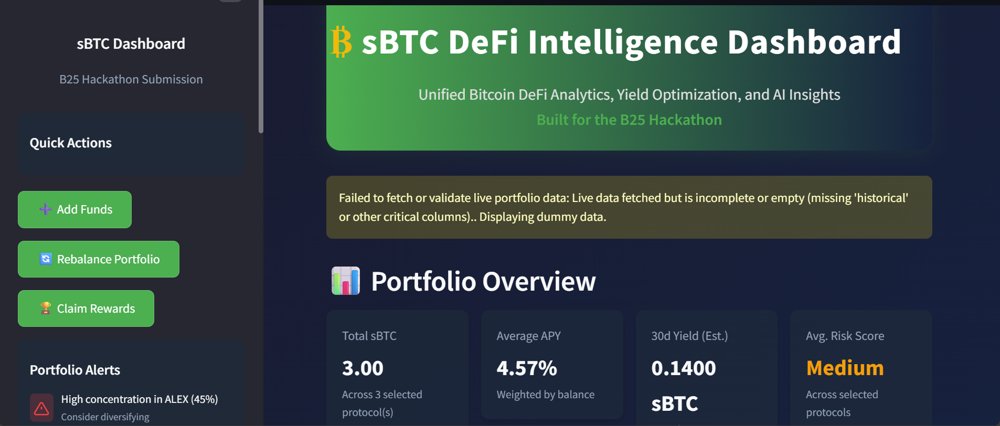

# ₿ sBTC DeFi Intelligence Dashboard

Unified Bitcoin DeFi Analytics, Yield Optimization, and AI Insights

---



## 🚀 Overview

The **sBTC DeFi Intelligence Dashboard** is a professional, hackathon-ready Streamlit app for unified analytics and portfolio management across Bitcoin DeFi protocols. Built for the B25 Hackathon, it empowers users to:

- Track sBTC balances, APY, yield, and risk across protocols
- Visualize historical and real-time performance
- Filter and analyze by protocol
- Receive AI-powered portfolio insights and recommendations
- Access educational resources and wallet integration options

## ✨ Features

- **Professional UI/UX:** Modern, responsive dashboard with custom theming
- **Protocol Filtering:** Sidebar multi-select to filter all analytics by protocol
- **Portfolio Metrics:** Total sBTC, weighted APY, yield, and risk scoring
- **Interactive Visualizations:** Pie, line, bar, and area charts (Plotly)
- **AI Insights:** Simulated Gemini Pro AI recommendations and health checks
- **Wallet Integration (UI):** Connect Stacks wallets (Hiro, Xverse, Leather) or enter address manually
- **Educational Tabs:** Learn about sBTC, DeFi strategies, and protocol mechanics
- **Hackathon Resources:** Quick links to docs, protocols, and Devpost
- **Connect with Me:** Sidebar links for networking
- **Robust Error Handling:** Dummy data fallback and debug panel for judges

## 🛠️ Tech Stack

- **Streamlit**: Frontend and dashboard framework
- **Plotly**: Interactive charts and visualizations
- **Pandas/Numpy**: Data manipulation and mock data
- **Python**: Core logic and data processing
- **Gemini Pro (Simulated)**: AI-powered summaries and recommendations
- **Custom CSS/HTML**: Professional theming

## 📦 Requirements

See `requirements.txt` for exact versions and comments. Key dependencies:

- streamlit
- plotly
- pandas
- numpy
- requests

## ⚡ Quick Start

1. **Clone the repo:**

   ```sh
   git clone <your-repo-url>
   cd BTC++
   ```

2. **Install dependencies:**

   ```sh
   pip install -r requirements.txt
   ```

3. **Run the dashboard:**

   ```sh
   streamlit run app.py
   ```

4. **(Optional) Set Streamlit secrets:**
   - For debug mode, add `DEBUG_MODE = true` in `.streamlit/secrets.toml`

## 🖥️ Usage

- Use the sidebar to filter protocols, access resources, and connect with the author
- Explore tabs for portfolio overview, protocol breakdown, AI insights, and education
- All metrics and charts update dynamically based on your protocol selection

## 🏆 Hackathon Context

- **Submission:** B25 Hackathon (2024)
- **Team:** Bitcoin DeFi Builders
- **Contact:** muhammadatiflatif67@gmail.com
- **Devpost:** [b25.devpost.com](https://b25.devpost.com/)

## 🙏 Credits

- Built by Muhammad Atif Latif
- Powered by Stacks, sBTC, and the Bitcoin DeFi community
- For demo purposes only. Not financial advice.

## ☕ Support Me

If you found this project helpful, you can [support me here](https://atiflatif7.gumroad.com/l/xyobfh)!

## 🔗 Connect

- [Email](mailto:muhammadatiflatif67@gmail.com)
- [LinkedIn](https://www.linkedin.com/in/muhammad-atif-latif-13a171318?utm_source=share&utm_campaign=share_via&utm_content=profile&utm_medium=android_app)
- [Kaggle](https://www.kaggle.com/muhammadatiflatif)
- [X (Twitter)](https://x.com/mianatif5867?s=09)
- [GitHub](https://github.com/M-Atif-Latif)
- [Buy Me a Coffee](https://buymeacoffee.com/muhammadatiflatif)

---

*Built for the B25 Hackathon | All data is for demonstration purposes only.*
